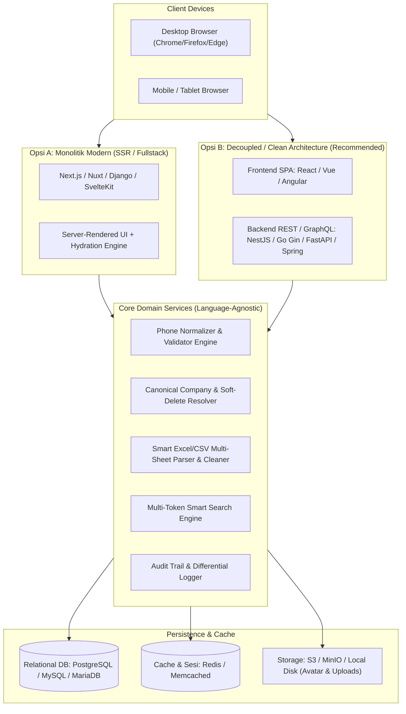
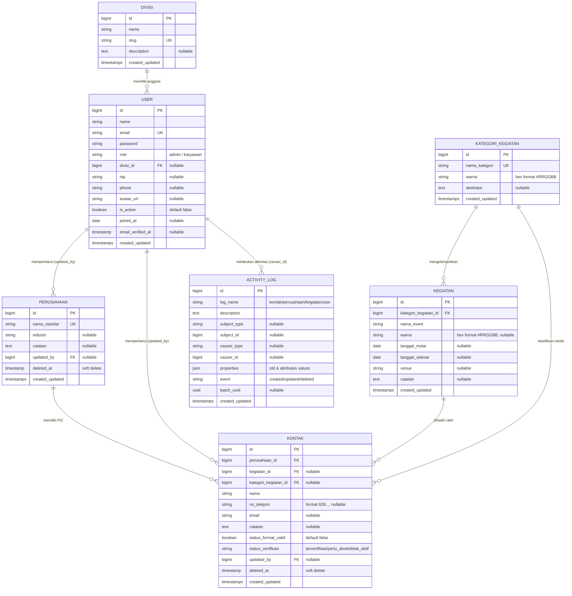
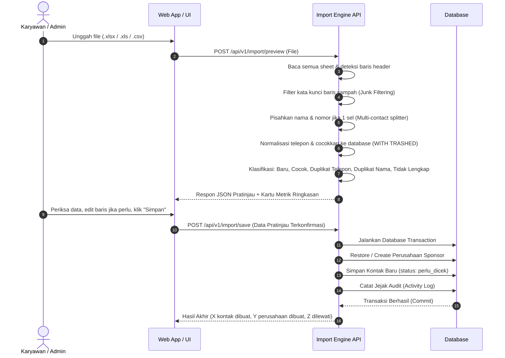
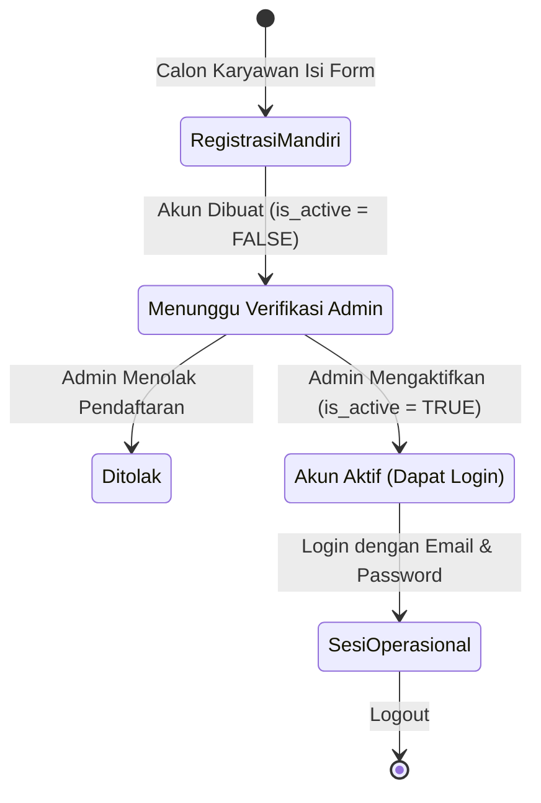
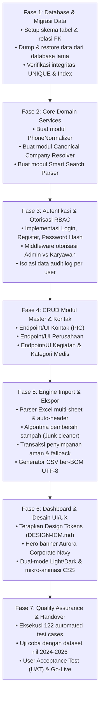

# Blueprint Arsitektur & Panduan Migrasi Sistem Informasi ICM Sponsor
**Dokumentasi Teknis Lengkap untuk Migrasi Antar-Bahasa Pemrograman**  
*Platform: Digital Sponsorship & PIC Archive — Indonesia Congress Management (ICM)*  
*Versi Dokumen: 2.0 (Production-Ready)*  
*Standar Dokumen: Language-Agnostic Software Architecture & Specification*

---

## Daftar Isi
1. [Pendahuluan & Domain Bisnis](#1-pendahuluan--domain-bisnis)
2. [Arsitektur Sistem & Topologi Rekayasa](#2-arsitektur-sistem--topologi-rekayasa)
3. [Spesifikasi Skema Basis Data & Relasi Entitas (ERD)](#3-spesifikasi-skema-basis-data--relasi-entitas-erd)
4. [Aturan Bisnis & Algoritma Inti (Core Algorithms)](#4-aturan-bisnis--algoritma-inti-core-algorithms)
5. [Spesifikasi Keamanan, Autentikasi, & Matriks RBAC](#5-spesifikasi-keamanan-autentikasi--matriks-rbac)
6. [Kontrak Antarmuka & Spesifikasi API (RESTful Endpoints)](#6-kontrak-antarmuka--spesifikasi-api-restful-endpoints)
7. [Spesifikasi Desain UI/UX & Standar Tampilan Enterprise](#7-spesifikasi-desain-uiux--standar-tampilan-enterprise)
8. [Acceptance Criteria & Skenario Pengujian (Test Suite)](#8-acceptance-criteria--skenario-pengujian-test-suite)
9. [Panduan Langkah Demi Langkah Migrasi (Migration Roadmap)](#9-panduan-langkah-demi-langkah-migrasi-migration-roadmap)

---

## 1. Pendahuluan & Domain Bisnis

### 1.1. Latar Belakang Masalah
Sebelum sistem ini dibuat, arsip data sponsor dan kontak *Person in Charge* (PIC) pada kegiatan kongres medis yang dikelola oleh Indonesia Congress Management (ICM) tersimpan secara terpisah dalam puluhan file spreadsheet (Microsoft Excel/CSV). Pola lama ini menimbulkan kendala fatal:
- **Penyebaran Data & Duplikasi**: Nama perusahaan yang sama ditulis dengan beragam variasi (misal: "PT Bayer", "Bayer", "Bayer Indonesia"), membuat riwayat kerja sama terpecah.
- **Ketiadaan Validasi Format**: Nomor telepon diinput tanpa standarisasi (ada yang memakai tanda kurung, strip, spasi, awalan 08, +62, atau nomor kantor).
- **Risiko Kehilangan Data & Konflik Versi**: Perubahan data tidak memiliki jejak audit (*who changed what and when*).
- **Ketidakefisienan Operasional**: Staf sponsorship membutuhkan waktu bermenit-menit hanya untuk mencari siapa PIC dari suatu perusahaan farmasi/alat kesehatan.

### 1.2. Tujuan Sistem
Sistem Informasi ICM Sponsor dibangun sebagai **Arsip Digital Terpadu (*Single Source of Truth*)** untuk:
1. Menyimpan, menstandarisasi, dan mengkorelasikan data kontak PIC dengan perusahaan sponsor dan riwayat event kongres medis.
2. Memberikan pencarian kilat (*Smart Search*) multi-kata yang responsif dalam hitungan milidetik.
3. Memfasilitasi komunikasi direct-to-WhatsApp dalam satu klik.
4. Menyediakan mesin impor cerdas yang mampu mengekstrak file Excel kotor/bervariasi tanpa merusak database.
5. Menjamin keamanan data operasional melalui kontrol hak akses berjenjang (*Role-Based Access Control*) dan isolasi privasi jejak audit.

### 1.3. Aktor & Persona Pengguna
| Role / Aktor | Deskripsi & Hak Akses Utama |
| :--- | :--- |
| **Administrator (`admin`)** | Kontrol penuh sistem: persetujuan akun karyawan baru, manajemen master data (Divisi, Kategori Medis, Kegiatan), melihat seluruh log histori aktivitas sistem, ekspor/impor data, dan melakukan penyamaran akun (*impersonation*) untuk troubleshooting. |
| **Karyawan / Staf Sponsor (`karyawan`)** | Pengguna operasional: mengelola data kontak PIC, melihat & memperbarui data perusahaan sponsor, melihat data kegiatan/event, mengunduh ekspor laporan CSV, dan melihat jejak audit aktivitas miliknya sendiri. |
| **Tamu / Calon Karyawan (`guest`)** | Mendaftar akun mandiri melalui form registrasi; berstatus *inactive/pending approval* hingga diverifikasi dan diaktifkan oleh Administrator. |

---

## 2. Arsitektur Sistem & Topologi Rekayasa

### 2.1. Pilihan Pola Arsitektur Jika Pindah Bahasa
Saat ini sistem dibangun dengan monolit modular menggunakan PHP / Laravel 12 + Livewire 3 + Filament v3. Jika sewaktu-waktu dimigrasikan ke bahasa pemrograman lain (seperti **TypeScript/Node.js**, **Go**, **Python**, atau **C# / Java**), arsitektur dapat diimplementasikan dalam 2 pilihan model:



---

## 3. Spesifikasi Skema Basis Data & Relasi Entitas (ERD)

Database menggunakan RDBMS relasional dengan kepatuhan standar SQL-92/2003 (kompatibel dengan MySQL 8.0+, MariaDB 10.5+, dan PostgreSQL 14+).

### 3.1. Entity-Relationship Diagram (ERD)


### 3.2. Spesifikasi Tabel & DDL SQL
Di bawah ini adalah definisi skema tabel standar:

```sql
-- 1. TABEL DIVISI
CREATE TABLE divisis (
    id BIGINT AUTO_INCREMENT PRIMARY KEY,
    name VARCHAR(255) NOT NULL,
    slug VARCHAR(255) NOT NULL UNIQUE,
    description TEXT NULL,
    created_at TIMESTAMP NULL,
    updated_at TIMESTAMP NULL
);

-- 2. TABEL USERS
CREATE TABLE users (
    id BIGINT AUTO_INCREMENT PRIMARY KEY,
    name VARCHAR(255) NOT NULL,
    email VARCHAR(255) NOT NULL UNIQUE,
    password VARCHAR(255) NOT NULL,
    role VARCHAR(50) NOT NULL DEFAULT 'karyawan', -- 'admin' atau 'karyawan'
    divisi_id BIGINT NULL,
    nip VARCHAR(100) NULL,
    phone VARCHAR(50) NULL,
    avatar_url VARCHAR(255) NULL,
    is_active BOOLEAN NOT NULL DEFAULT FALSE,
    joined_at DATE NULL,
    email_verified_at TIMESTAMP NULL,
    remember_token VARCHAR(100) NULL,
    created_at TIMESTAMP NULL,
    updated_at TIMESTAMP NULL,
    CONSTRAINT fk_users_divisi FOREIGN KEY (divisi_id) REFERENCES divisis(id) ON DELETE SET NULL
);

-- 3. TABEL KATEGORI KEGIATAN (SPESIALISASI MEDIS)
CREATE TABLE kategori_kegiatans (
    id BIGINT AUTO_INCREMENT PRIMARY KEY,
    nama_kategori VARCHAR(255) NOT NULL UNIQUE,
    warna VARCHAR(7) NOT NULL DEFAULT '#1E2A4A', -- format #RRGGBB
    deskripsi TEXT NULL,
    created_at TIMESTAMP NULL,
    updated_at TIMESTAMP NULL
);

-- 4. TABEL KEGIATAN / EVENT
CREATE TABLE kegiatans (
    id BIGINT AUTO_INCREMENT PRIMARY KEY,
    kategori_kegiatan_id BIGINT NOT NULL,
    nama_event VARCHAR(255) NOT NULL,
    warna VARCHAR(7) NULL,
    tanggal_mulai DATE NULL,
    tanggal_selesai DATE NULL,
    venue VARCHAR(255) NULL,
    catatan TEXT NULL,
    created_at TIMESTAMP NULL,
    updated_at TIMESTAMP NULL,
    CONSTRAINT fk_kegiatans_kategori FOREIGN KEY (kategori_kegiatan_id) REFERENCES kategori_kegiatans(id) ON DELETE RESTRICT
);

-- 5. TABEL PERUSAHAAN SPONSOR
CREATE TABLE perusahaans (
    id BIGINT AUTO_INCREMENT PRIMARY KEY,
    nama_standar VARCHAR(255) NOT NULL UNIQUE,
    industri VARCHAR(255) NULL,
    catatan TEXT NULL,
    updated_by BIGINT NULL,
    created_at TIMESTAMP NULL,
    updated_at TIMESTAMP NULL,
    deleted_at TIMESTAMP NULL, -- Soft Delete
    CONSTRAINT fk_perusahaans_user FOREIGN KEY (updated_by) REFERENCES users(id) ON DELETE SET NULL
);
CREATE INDEX idx_perusahaans_nama ON perusahaans(nama_standar);

-- 6. TABEL KONTAK PIC SPONSOR
CREATE TABLE kontaks (
    id BIGINT AUTO_INCREMENT PRIMARY KEY,
    perusahaan_id BIGINT NOT NULL,
    kegiatan_id BIGINT NULL,
    kategori_kegiatan_id BIGINT NULL,
    nama VARCHAR(255) NOT NULL,
    no_telepon VARCHAR(50) NULL,
    email VARCHAR(255) NULL,
    catatan TEXT NULL,
    status_format_valid BOOLEAN NOT NULL DEFAULT FALSE,
    status_verifikasi VARCHAR(50) NOT NULL DEFAULT 'perlu_dicek', -- 'terverifikasi', 'perlu_dicek', 'tidak_aktif'
    updated_by BIGINT NULL,
    created_at TIMESTAMP NULL,
    updated_at TIMESTAMP NULL,
    deleted_at TIMESTAMP NULL, -- Soft Delete
    CONSTRAINT fk_kontaks_perusahaan FOREIGN KEY (perusahaan_id) REFERENCES perusahaans(id) ON DELETE CASCADE,
    CONSTRAINT fk_kontaks_kegiatan FOREIGN KEY (kegiatan_id) REFERENCES kegiatans(id) ON DELETE SET NULL,
    CONSTRAINT fk_kontaks_kategori FOREIGN KEY (kategori_kegiatan_id) REFERENCES kategori_kegiatans(id) ON DELETE SET NULL,
    CONSTRAINT fk_kontaks_user FOREIGN KEY (updated_by) REFERENCES users(id) ON DELETE SET NULL
);
CREATE INDEX idx_kontaks_telepon ON kontaks(no_telepon);
CREATE INDEX idx_kontaks_nama ON kontaks(nama);
CREATE INDEX idx_kontaks_status ON kontaks(status_verifikasi);

-- 7. TABEL AUDIT TRAIL / ACTIVITY LOG
CREATE TABLE activity_log (
    id BIGINT AUTO_INCREMENT PRIMARY KEY,
    log_name VARCHAR(255) NULL,
    description TEXT NOT NULL,
    subject_type VARCHAR(255) NULL,
    subject_id BIGINT NULL,
    causer_type VARCHAR(255) NULL,
    causer_id BIGINT NULL,
    properties JSON NULL, -- {"old": {...}, "attributes": {...}}
    event VARCHAR(50) NULL, -- 'created', 'updated', 'deleted'
    batch_uuid CHAR(36) NULL,
    created_at TIMESTAMP NULL,
    updated_at TIMESTAMP NULL
);
CREATE INDEX idx_activity_subject ON activity_log(subject_type, subject_id);
CREATE INDEX idx_activity_causer ON activity_log(causer_type, causer_id);
```

---

## 4. Aturan Bisnis & Algoritma Inti (Core Algorithms)

Seluruh logika di bawah ini bersifat independen dari bahasa pemrograman (*language-agnostic*) dan **wajib diimplementasikan persis sama** pada backend baru.

### 4.1. Algoritma Normalisasi Nomor Telepon (`PhoneNormalizer`)
Tujuan: Menjamin seluruh nomor kontak di Indonesia memiliki representasi tunggal yang valid untuk integrasi WhatsApp (`wa.me/628...`).

```text
FUNGSI normalize(phone_string):
    1. Input dibersihkan dari spasi ujung (trim).
    2. Jika string kosong, kembalikan "".
    3. Hapus seluruh karakter non-digit (0-9).
    4. Buang seluruh angka nol '0' di bagian paling depan (ltrim '0').
    5. JIKA nomor diawali dengan "620":
           Ubah menjadi "62" + sisa digit setelah indeks ke-3 (koreksi typo "6208...").
    6. JIKA nomor TIDAK diawali "62" DAN diawali "8":
           Tambahkan awalan "62" di depannya (misal "81234..." -> "6281234...").
    7. Kembalikan string angka bersih.

FUNGSI isValid(normalized_phone):
    Cocokkan dengan Regex: ^628[0-9]{7,10}$
    Artinya:
    - Harus diawali "628"
    - Diikuti 7 hingga 10 digit angka
    - Total panjang string adalah 10 hingga 13 digit.
    Kembalikan TRUE jika cocok, FALSE jika tidak.
```

### 4.2. Algoritma Penyeragaman Nama Baku Perusahaan (`Canonical Naming`)
Tujuan: Menggabungkan variasi sebutan perusahaan ke satu entitas resmi agar tidak terduplikasi di database.

```text
FUNGSI canonicalCompanyName(raw_name):
    1. Trim dan ubah ke huruf kapital terstandar.
    2. Hapus prefiks/sufiks badan usaha:
       - "PT.", "PT ", "PT", "P.T."
       - "CV.", "CV ", "CV"
       - "PERSEROAN TERBATAS"
       - "CORP", "INC", "LTD", "TBK"
    3. Hilangkan karakter non-alfanumerik berlebih di ujung nama (titik, koma, strip).
    4. Rapikan multi-spasi menjadi satu spasi.
    5. Cocokkan dengan Kamus Alias Kanonikal (contoh: "BAYER INDONESIA" -> "Bayer").
    6. Kembalikan Nama Baku Terpilih.
```

> [!IMPORTANT]
> **Aturan Soft-Deletes pada Database (Pencegahan Bug 1062)**:  
> Ketika pengguna mencoba menyimpan perusahaan baru, lakukan pencarian ke database menggunakan `WITH TRASHED` (termasuk baris yang `deleted_at IS NOT NULL`).  
> - Jika ditemukan dalam kondisi terhapus (*trashed*), **LAKUKAN RESTORE** dan gunakan kembali ID tersebut.  
> - **JANGAN PERNAH** mencoba menjalankan `INSERT` jika nama perusahaan tersebut ada di tempat sampah, karena MySQL akan menolak dengan error `1062 Duplicate entry`.

### 4.3. Algoritma Smart Search Multi-Token
Tujuan: Mengizinkan pencarian kontak yang intuitif di mana urutan kata tidak mempengaruhi hasil, serta mengenali potongan nomor telepon secara otomatis.

```text
FUNGSI applySmartSearch(query, search_string):
    1. Pecah search_string berdasarkan karakter spasi menjadi array of TOKENS.
    2. UNTUK SETIAP token:
           a. Tentukan tipe token:
              - Jika token murni angka (digits):
                    Hitung jumlah digit.
                    Jika digit >= 4:
                        Buat phone_pattern = "%" + normalize(token) + "%"
                        Cocokkan token ke kolom: kontaks.no_telepon LIKE phone_pattern
              - Jika token mengandung huruf/campuran:
                    Buat text_pattern = "%" + token + "%"
                    Cocokkan token (OR) ke kolom:
                        - perusahaans.nama_standar LIKE text_pattern
                        - kontaks.nama LIKE text_pattern
                        - kegiatans.nama_event LIKE text_pattern
                        - kategori_kegiatans.nama_kategori LIKE text_pattern
           b. Gabungkan aturan tiap token dengan klausa AND.
    3. Kembalikan query hasil filter.
```

### 4.4. Algoritma Peta Nomor Duplikat Lintas Perusahaan
Tujuan: Mencegah dan mendeteksi anomali nomor PIC yang sama yang digunakan untuk mewakili perusahaan berbeda.

```text
FUNGSI getDuplicatePhoneMap():
    1. Eksekusi query agregat:
       SELECT no_telepon FROM kontaks 
       WHERE no_telepon IS NOT NULL AND no_telepon != '' 
       GROUP BY no_telepon 
       HAVING COUNT(DISTINCT perusahaan_id) > 1
    2. Simpan hasilnya di Redis Cache selama 60 detik (kunci: "icm:peta_nomor_perusahaan").
    3. Jika baris kontak yang sedang di-render memiliki no_telepon yang ada di peta ini:
       - Berikan badge peringatan visual / sorotan merah.
       - Tampilkan nama perusahaan lain yang juga menggunakan nomor ini.
```

### 4.5. Algoritma Engine Impor Excel Cerdas (Smart Import Engine)
Alur impor Excel dirancang bertingkat (*two-phase confirmation*):



**Daftar Kata Kunci Baris Sampah (*Junk Words*) yang Harus Diabaikan Otomatis**:  
`koordinasi`, `serah terima`, `loading`, `vendor`, `doorprize`, `persiapan`, `qty`, `checklist`, `cheklist`, `spanduk`, `banner`, `sound`, `sound system`, `tata letak`, `panitia`, `cek kelengkapan`, `pita pembukaan`, `jumlah booth`, `floor plan`, `total nominal`, `tidak berpartisipasi`.

---

## 5. Spesifikasi Keamanan, Autentikasi, & Matriks RBAC

### 5.1. Alur Autentikasi & Approval Workflow


### 5.2. Matriks Otorisasi Berbasis Peran (RBAC Matrix)
| Modul / Fungsi | Hak Akses Administrator (`admin`) | Hak Akses Karyawan (`karyawan`) |
| :--- | :---: | :---: |
| **Login & Profil Saya** | ✅ Penuh | ✅ Penuh (Hanya profil miliknya) |
| **Kontak PIC (CRUD)** | ✅ Penuh (Create, Read, Update, Delete) | ✅ Read, Create, Update (Soft-Delete) |
| **Perusahaan (CRUD)** | ✅ Penuh | ✅ Read, Create, Update (Dilarang Hapus) |
| **Kegiatan / Event** | ✅ Penuh | 👁️ Read-Only (Hanya melihat data) |
| **Kategori Medis** | ✅ Penuh | ❌ Ditolak (403 Forbidden) |
| **Manajemen Pengguna & Divisi** | ✅ Penuh | ❌ Ditolak (403 Forbidden) |
| **Import Excel & Ekspor CSV** | ✅ Penuh | ✅ Penuh |
| **User Impersonation** | ✅ Penuh | ❌ Ditolak (403 Forbidden) |
| **Jejak Audit (Histori)** | 🌐 Melihat **Seluruh** Histori Sistem | 🔒 Hanya melihat histori **milik sendiri** |

### 5.3. Struktur JSON Log Aktivitas (Differential Audit Trail)
Setiap perubahan data (Update) wajib mencatat state sebelum (`old`) dan sesudah (`attributes`):
```json
{
  "log_name": "kontak",
  "event": "updated",
  "causer_id": 3,
  "causer_type": "App\Models\User",
  "subject_id": 142,
  "subject_type": "App\Models\Kontak",
  "properties": {
    "old": {
      "nama": "Budi Raharjo",
      "no_telepon": "628123456789",
      "status_verifikasi": "perlu_dicek"
    },
    "attributes": {
      "nama": "Budi Raharjo, S.Farm",
      "no_telepon": "628123456789",
      "status_verifikasi": "terverifikasi"
    }
  },
  "created_at": "2026-09-09T14:30:00Z"
}
```

---

## 6. Kontrak Antarmuka & Spesifikasi API (RESTful Endpoints)

Jika backend baru dibangun terpisah (Headless API), endpoint standar yang harus disediakan adalah sebagai berikut:

### 6.1. Autentikasi
- `POST /api/v1/auth/login` -> `{ email, password }` -> Mengembalikan Bearer Token / JWT.
- `POST /api/v1/auth/register` -> `{ name, email, password, divisi_id, phone }` -> Registrasi akun pending.
- `GET /api/v1/auth/me` -> Informasi user login + role + permissions.

### 6.2. Manajemen Kontak PIC
- `GET /api/v1/kontaks`
  - Query Params: `search` (multi-token), `kategori_id`, `kegiatan_id`, `status_verifikasi`, `per_page` (default 25), `page`.
  - Response: JSON Resource Collection + Pagination Meta + KPI Header Summary.
- `POST /api/v1/kontaks` -> Create kontak PIC baru (auto-normalisasi nomor).
- `GET /api/v1/kontaks/{id}` -> Detail kontak (termasuk perusahaan, kegiatan, kategori, dan deteksi nomor sama).
- `PUT /api/v1/kontaks/{id}` -> Update kontak (otomatis mencatat audit trail).
- `DELETE /api/v1/kontaks/{id}` -> Soft-delete kontak.

### 6.3. Manajemen Perusahaan
- `GET /api/v1/perusahaans` -> Daftar perusahaan terstandarisasi + jumlah PIC.
- `POST /api/v1/perusahaans` -> Buat perusahaan baku (cek with-trashed untuk restore).
- `PUT /api/v1/perusahaans/{id}` -> Update nama standar / industri / catatan.
- `DELETE /api/v1/perusahaans/{id}` -> Soft-delete (khusus Admin).

### 6.4. Smart Import Engine
- `POST /api/v1/import/preview`
  - Body: `multipart/form-data` (file: .xlsx, .csv, maks 10MB).
  - Response:
    ```json
    {
      "counts": {
        "kontak_baru": 121,
        "perusahaan_baru": 14,
        "cocok": 85,
        "duplikat": 17,
        "data_tidak_lengkap": 5,
        "nomor_tidak_valid": 8
      },
      "previews": [
        {
          "sheet": "Sheet1",
          "baris": 2,
          "nama_perusahaan": "Bayer",
          "perusahaan_id": 1,
          "perusahaan_status": "cocok",
          "nama": "Rangga",
          "no_telepon": "628111465133",
          "no_telepon_valid": true,
          "status_kontak": "dibuat",
          "alasan": null
        }
      ]
    }
    ```
- `POST /api/v1/import/save`
  - Body: JSON array `previews` hasil konfirmasi.
  - Response: `{ "kontak_dibuat": 121, "perusahaan_dibuat": 14, "dilewati": 22 }`.

### 6.5. Ekspor Data
- `GET /api/v1/kontaks/export-csv`
  - Menerapkan filter aktif dari URL.
  - Response: Binary Stream `text/csv; charset=UTF-8` dengan **BOM `\xEF\xBB\xBF`**.

### 6.6. Dashboard Analytics
- `GET /api/v1/dashboard/metrics` -> Total Perusahaan, Total Kontak, Terverifikasi, Pending, Tidak Aktif, Total Event.
- `GET /api/v1/dashboard/chart-kategori` -> Pembagian event per kategori kedokteran (% share & bar width).
- `GET /api/v1/dashboard/chart-top-event` -> Top 5 event dengan PIC terbanyak.

---

## 7. Spesifikasi Desain UI/UX & Standar Tampilan Enterprise

Selaras dengan dokumen `DESIGN-ICM.md`, aplikasi baru wajib menerapkan sistem desain enterprise berikut:

### 7.1. Palet Warna Semantik Resmi
```css
:root {
  /* Brand Identity ICM */
  --color-primary: #18225E;       /* Royal Navy — Elegan, Wibawa, Stabil */
  --color-secondary: #EA7C1A;     /* Congress Orange — Aksen Dinamis, Energik */
  
  /* Status Semantik */
  --color-success: #10B981;       /* Emerald — Terverifikasi / Valid */
  --color-warning: #F59E0B;       /* Amber — Perlu Dicek / Pending */
  --color-danger: #F43F5E;        /* Rose / Red — Tidak Aktif / Duplikat */
  --color-info: #0284C7;          /* Sky Blue — Terhubung / Informasi */

  /* Kanvas & Permukaan (Light Mode) */
  --bg-canvas: #F8FAFC;
  --bg-surface: #FFFFFF;
  --border-card: #E2E8F0;
  --text-primary: #0F172A;
  --text-muted: #64748B;
}

/* Dark Mode (Deep Navy Command Center) */
.dark {
  --bg-canvas: #080E21;
  --bg-surface: #101935;
  --border-card: #1E294B;
  --text-primary: #F8FAFC;
  --text-muted: #94A3B8;
}
```

### 7.2. Aturan Tipografi
- **Body / Interface**: `Fira Sans` / `Inter` (ukuran 13px - 14px, line-height 1.4).
- **Display / Headings**: `Sora` (letter-spacing -0.02em, font-weight 700).
- **Numeric / Monospace**: `IBM Plex Mono` (khusus nomor telepon, nominal, persentase, dan KPI counts).

### 7.3. Desain Komponen Utama
1. **Hero Banner Sambutan**:
   - Selalu berlatar belakang gelap **Aurora Corporate Navy** (`linear-gradient(135deg, #101935 0%, #18225E 55%, #1E294B 100%)`).
   - Teks judul berwarna **putih murni (`#FFFFFF`)** dan deskripsi **slate terang (`#CBD5E1`)**.
   - Dilengkapi aksen ambient blur *Sky Blue* dan *Congress Orange* dengan badge berdenyut (*pulsing dot*).
2. **Sidebar Navigasi**:
   - Menu aktif memiliki **bilah aksen vertikal oranye (`#EA7C1A` -> `#F59E0B`)** dengan soft glow di sisi kiri.
   - Efek hover mikro bergeser 2px ke kanan (`translateX(2px)`).
3. **Kepadatan Data (Enterprise High-Density)**:
   - Tinggi baris tabel antara **44px hingga 48px**.
   - Header sel tabel ringkas (padding `0.625rem 0.75rem`), teks kapital, font-weight 600.
4. **Mikro-Animasi CSS Murni (60 FPS)**:
   - Transisi halaman: `@keyframes fiFadeInScale { from { opacity: 0; transform: translateY(4px); } to { opacity: 1; transform: translateY(0); } }`.
   - Tombol aktif: `transform: scale(0.98);`.
   - Hover kartu: `transform: translateY(-2px); box-shadow: 0 8px 20px -4px rgba(0,0,0,0.1);`.

---

## 8. Acceptance Criteria & Skenario Pengujian (Test Suite)

Jika sistem dibangun ulang di bahasa lain, implementasikan minimal **122 skenario pengujian unit/integrasi** berikut sebagai tolok ukur kesuksesan:

| No | Modul Pengujian | Target Kriteria Penerimaan (*Acceptance Criteria*) |
| :---: | :--- | :--- |
| **1** | Autentikasi | User tamu dapat mendaftar; user baru tidak bisa login sebelum `is_active = true`; login sukses menghasilkan sesi/token valid; salah password gagal dengan proteksi rate limit. |
| **2** | Role & Permission | Role Admin dapat akses seluruh menu; Karyawan dilarang membuka Kategori Medis (403); Karyawan dilarang menghapus Perusahaan. |
| **3** | Normalisasi Nomor HP | `0811...` -> `62811...`; `+628...` -> `628...`; `6208...` -> `628...`; nomor 10-13 digit valid = `status_format_valid: true`. |
| **4** | Smart Search | Multi-kata `Bayer Rangga` menemukan kontak yang tepat; pencarian nomor `0811` otomatis mencocokkan `62811...`; pencarian nama kategori menemukan kontak terkait. |
| **5** | Deteksi Duplikat Nomor | Jika nomor yang sama dimiliki >1 perusahaan, tandai baris tabel dengan flag anomali/danger. |
| **6** | Engine Import (Pencocokan) | Baris tanpa PIC diabaikan jika perusahaan kosong; deteksi baris sampah (*junk*); deteksi multi-sheet; deteksi nomor invalid tanpa membatalkan import. |
| **7** | Engine Import (Soft-Delete) | Jika perusahaan ada di status soft-deleted, fungsi import otomatis melakukan `restore()` tanpa memicu error `1062 Duplicate Entry`. |
| **8** | Dashboard Metrik | Metrik KPI menghitung angka akurat dari database; agregat di-cache selama 60 detik untuk mencegah beban berlebih saat diakses bersamaan. |
| **9** | Ekspor CSV | File yang diunduh berformat UTF-8 BOM; karakter tanda baca / aksen bahasa Indonesia tidak rusak saat dibuka di Microsoft Excel. |
| **10**| Audit Trail Privasi | Perubahan data kontak mencatat diff properti sebelum & sesudah; Karyawan hanya dapat mengambil data log aktivitas miliknya sendiri. |

---

## 9. Panduan Langkah Demi Langkah Migrasi (Migration Roadmap)

Bagi tim pengembang yang bertugas memigrasikan sistem ke bahasa/framework baru, ikuti roadmap terstruktur 7 fase ini:



### Rekomendasi Tech Stack Alternatif (Jika Bermigrasi)
1. **TypeScript Ecosystem (Node.js)**:
   - Backend: **NestJS** (Prisma / TypeORM) + **Fastify**.
   - Frontend: **Next.js** (App Router) / **React** + Tailwind CSS v4 + TanStack Table / Query.
2. **Go Ecosystem**:
   - Backend: **Go Gin / Fiber** + **GORM / sqlc** (Sangat cepat, konsumsi RAM < 30MB).
   - Frontend: **Vue 3** / **Svelte** + Tailwind CSS.
3. **Python Ecosystem**:
   - Backend: **FastAPI** + **SQLAlchemy 2.0** + Pydantic v2 (Bagus untuk manipulasi Excel dengan `openpyxl` / `pandas`).
4. **C# / .NET Ecosystem**:
   - Backend: **ASP.NET Core Web API 9.0** + **Entity Framework Core** (Sangat stabil untuk standar enterprise).

---
*Dokumentasi ini disiapkan secara resmi sebagai panduan standar rekayasa perangkat lunak untuk menjamin keberlanjutan (*long-term maintainability*) sistem sponsorship Indonesia Congress Management.*
